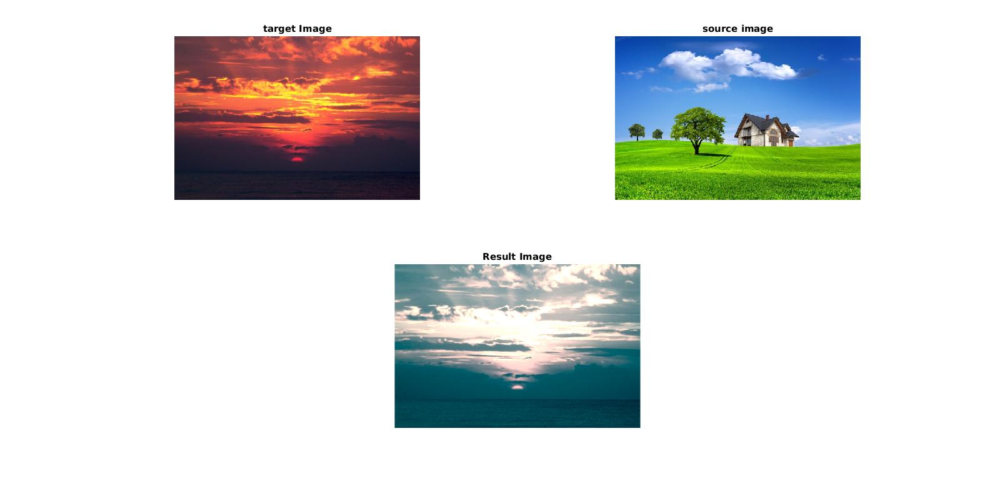

# Color Transfer Between Images

This project is the implementation of the paper [_Color Transfer
between Images_](http://www.cs.utah.edu/~shirley/papers/ColorTransfer.pdf) by Erik Reinhard, Michael Ashikhmin, Bruce Gooch and Peter Shirley.
### Concept
----------------------------
One of the most common tasks in image processing is to alter an image’s color. This paper describes a method for a more general form of color correction that borrows one image’s color characteristics from another.

### Algorithm
---

The procedure is as follows:
#### Conversion from RGB to ℓαβ color space.
Convert RGB color space to **ℓαβ** color space beacause of its **decorrelataion** between channels. The ℓ axis represents an achromatic channel, while the α and β channels are chromatic yellow–blue and red–green opponent channels. 

#### Statistics and color correction
First, we subtract the **mean** from the data points on each channel respectively:

Then, we scale the data points comprising the synthetic image by factors determined by the respective standard deviations:

Finally, we convert the result back to **RGB**.
### Results
---

### Usage
---
This code is written in **MATLAB**. Change the source and target image in source and target variable respectively in the 3rd and 4th line of ***color_transfer_built.m*** file.

